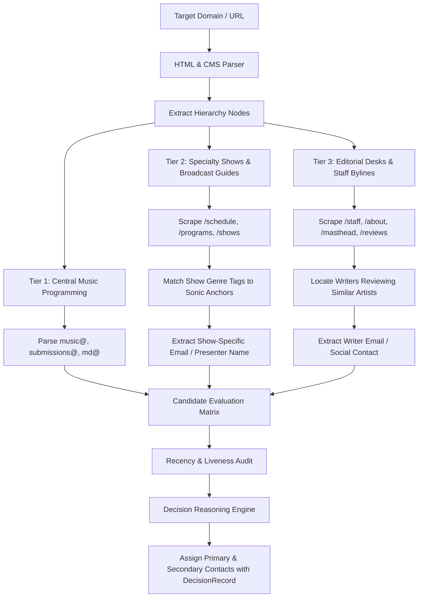
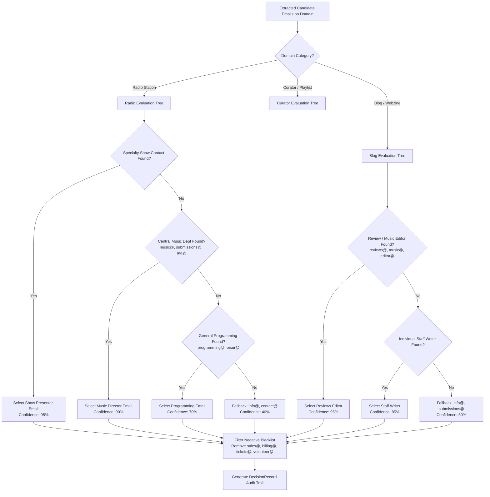
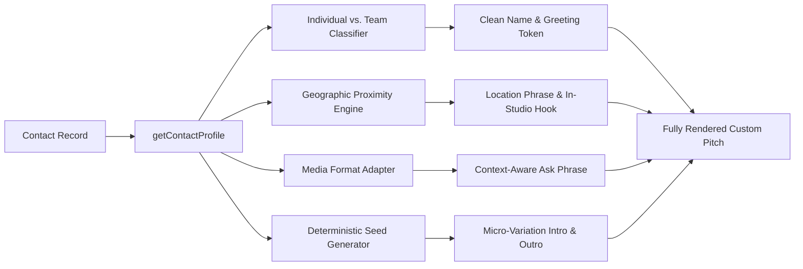
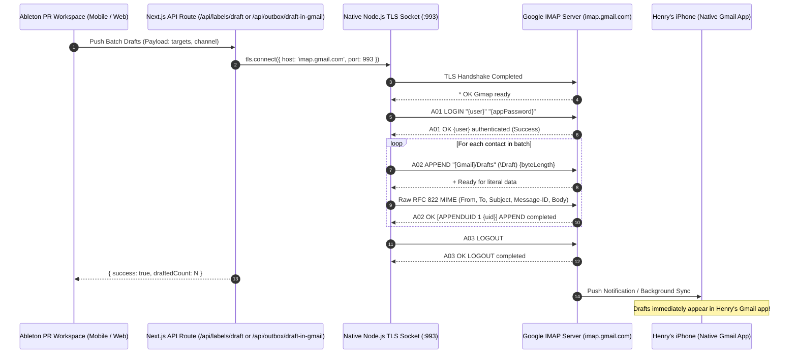
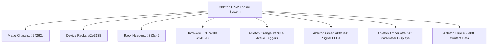

# MESSENGER PIGEON ON STEROIDS
## Master Soul Document & Complete System Architecture Specification
### Autonomous Music Industry PR, Contact Discovery, Angle Intelligence, Tone Engineering & Safe Dispatch System

> **Document Classification:** Master Architecture & Engineering Blueprint (AI-to-AI / Engineer-to-Engineer)  
> **Specification Version:** 3.7.0 (Context-Aware Pitch Synthesis & Autonomous Warmup Safety Engine)  
> **Status:** Ground Truth System Specification  
> **Author & Project Principal:** Henry Collins (Love Banana) & Engineering Team  
> **Target Execution Environment:** Next.js (App Router), TypeScript 5.x, Node.js runtime, Tailwind CSS, SQLite/JSON transactional store, Native IMAP TLS Drafting & Nodemailer SMTP Relay  

---

## TABLE OF CONTENTS
1. [Executive Architecture & The Core Thesis](#1-executive-architecture--the-core-thesis)
2. [Persona Architecture & The "Anti-Cringe" Doctrine](#2-persona-architecture--the-anti-cringe-doctrine)
3. [Deep Contact Discovery & Search Engine Intelligence](#3-deep-contact-discovery--search-engine-intelligence)
   - [3.1 The Multi-Tiered Discovery Pipeline](#31-the-multi-tiered-discovery-pipeline)
   - [3.2 Station-Level vs. Show-Level Radio Intelligence (The Dual-Gatekeeper Model)](#32-station-level-vs-show-level-radio-intelligence-the-dual-gatekeeper-model)
   - [3.3 Broadcast Schedule & Program Guide Parser Algorithm](#33-broadcast-schedule--program-guide-parser-algorithm)
   - [3.4 Editorial Mastheads & Writer Byline Scraping](#34-editorial-mastheads--writer-byline-scraping)
   - [3.5 Context-Aware Email Selection Tree & Decision Reasoning Chains](#35-context-aware-email-selection-tree--decision-reasoning-chains)
   - [3.6 The Structured `DecisionRecord` Schema & Audit Trail](#36-the-structured-decisionrecord-schema--audit-trail)
   - [3.7 Recency, Liveness & Domain Health Verification](#37-recency-liveness--domain-health-verification)
4. [Sonic Fingerprinting & Relevance Matching (Sound-Alike Intelligence)](#4-sonic-fingerprinting--relevance-matching-sound-alike-intelligence)
   - [4.1 Sonic Anchor & Reference Artist Matrix](#41-sonic-anchor--reference-artist-matrix)
   - [4.2 Tracklist & Airplay Log Scraper (AMRAP / Spinitron / Station Logs)](#42-tracklist--airplay-log-scraper-amrap--spinitron--station-logs)
   - [4.3 Evidence Citation Injection ("You Played X on Show Y")](#43-evidence-citation-injection-you-played-x-on-show-y)
   - [4.4 The Affinity Scoring Mathematical Model](#44-the-affinity-scoring-mathematical-model)
   - [4.5 Commercial Pay-to-Play Quarantine Blacklist](#45-commercial-pay-to-play-quarantine-blacklist)
5. [Context-Aware Contact Profiling & Angle Classification Engine](#5-context-aware-contact-profiling--angle-classification-engine)
   - [5.1 Individual vs. Department Entity Resolution (NLP Heuristics)](#51-individual-vs-department-entity-resolution-nlp-heuristics)
   - [5.2 Geographic Proximity & Hook Synthesis (Sydney vs. Aus vs. Overseas)](#52-geographic-proximity--hook-synthesis-sydney-vs-aus-vs-overseas)
   - [5.3 Media Format Adaptation (The "Anti-Spin" Protection Rule)](#53-media-format-adaptation-the-anti-spin-protection-rule)
6. [Dynamic Pitch Tone Synthesis & Anti-Spam Cryptography](#6-dynamic-pitch-tone-synthesis--anti-spam-cryptography)
   - [6.1 The Voice of the Musician (Henry Collins)](#61-the-voice-of-the-musician-henry-collins)
   - [6.2 Deterministic Seed Hashing (Breaking Spam Checksums)](#62-deterministic-seed-hashing-breaking-spam-checksums)
   - [6.3 Frictionless Asset Delivery (The Zero-Attachment Rule)](#63-frictionless-asset-delivery-the-zero-attachment-rule)
   - [6.4 The Anatomical Breakdown of a High-Converting Indie Pitch](#64-the-anatomical-breakdown-of-a-high-converting-indie-pitch)
7. [Safe Dispatch, Google Workspace Bypass & Reply-To Routing](#7-safe-dispatch-google-workspace-bypass--reply-to-routing)
   - [7.1 The Workspace App Password Deprecation Problem](#71-the-workspace-app-password-deprecation-problem)
   - [7.2 The Dual-Channel Relay Architecture](#72-the-dual-channel-relay-architecture)
   - [7.3 Device & Personal Email Isolation Guarantee](#73-device--personal-email-isolation-guarantee)
8. [Anti-Ban Dispatch Engine, Rate Limiting & Pacing](#8-anti-ban-dispatch-engine-rate-limiting--pacing)
   - [8.1 Stochastic Human Delay Simulation (6-13s Jitter)](#81-stochastic-human-delay-simulation-613s-jitter)
   - [8.2 Daily Throttle Thresholds & Warmup Curves](#82-daily-throttle-thresholds--warmup-curves)
   - [8.3 Error Isolation & Circuit Breaker Logic](#83-error-isolation--circuit-breaker-logic)
9. [Campaign Lifecycle & Follow-up Intelligence](#9-campaign-lifecycle--follow-up-intelligence)
   - [9.1 Pitch Timing Windows (Optimal Day & Hour Matrix)](#91-pitch-timing-windows-optimal-day--hour-matrix)
   - [9.2 The Single Polite Follow-up Rule](#92-the-single-polite-follow-up-rule)
   - [9.3 Inbound Response Classification & Automated Triage](#93-inbound-response-classification--automated-triage)
10. [Ableton Live 4/5/6 Hardware DAW Interface Design](#10-ableton-live-456-hardware-daw-interface-design)
    - [10.1 Industrial Design Principles & Palette Specifications](#101-industrial-design-principles--palette-specifications)
    - [10.2 Responsive Constraints & The 1024px Viewport Rule](#102-responsive-constraints--the-1024px-viewport-rule)
    - [10.3 Modular Device Rack Hierarchy & Signal Flow](#103-modular-device-rack-hierarchy--signal-flow)
11. [Complete Schemas, Data Models & API Specifications](#11-complete-schemas-data-models--api-specifications)
    - [11.1 Core TypeScript Interfaces](#111-core-typescript-interfaces)
    - [11.2 DecisionRecord & Audit Trail Schema](#112-decisionrecord--audit-trail-schema)
    - [11.3 REST API Endpoints Contract](#113-rest-api-endpoints-contract)
12. [Multi-Band Portability & Autonomous Blueprint](#12-multi-band-portability--autonomous-blueprint)

---

## 1. EXECUTIVE ARCHITECTURE & THE CORE THESIS

### 1.1 The Operational Vacuum in Independent Music PR
Independent musicians face an asymmetric, structurally broken publicity ecosystem:
1. **The Retainer Extortion Barrier:** Traditional music PR agencies charge \$2,500 to \$5,000 per 6-week single campaign. Standard industry agency contracts explicitly disclaim any guarantee of radio airplay, reviews, interviews, or playlist additions. DIY bands spend album recording budgets on PR retainers that return zero airplay.
2. **The "Promotions Tab" Death Sentence:** Musicians attempting DIY outreach through email marketing platforms (Mailchimp, MailerLite, SendGrid, Brevo) get automatically routed into Gmail’s "Promotions" or "Spam" tabs. Automated tracking pixels, unsubscribe footers, and shared bulk-relay IPs signal "commercial newsletter" to mail transfer agents (MTAs), bypassing the curator's primary inbox.
3. **The "Cold Publicist" Tone Disconnect:** Music directors, DJs, and zine editors receive between 150 and 400 email pitches daily. The overwhelming majority are written in breathless, hyperbolic marketing jargon (*"Rising sensation X drops their eagerly anticipated, genre-defying sonic journey..."*). Curators recognize this as third-party PR agency spam and delete it within seconds.
4. **Google Workspace Authentication Lockouts:** Musicians creating custom domain addresses (e.g., `henry@lovebanana.com`) find that Google has deprecated or locked App Passwords on 2FA Workspace accounts, while Google OAuth verification requires weeks of developer console security audits.

### 1.2 The Messenger Pigeon System Thesis
**Messenger Pigeon on Steroids** is an autonomous, high-velocity music industry outreach engine designed to run locally or server-side. It behaves like an **expert in-band tour manager and frontman combined**:
- **Tenet I: Authentic Musician Voice:** Outreach is authored strictly by the band’s songwriter/frontman (**Henry Collins**), using humble, direct, conversational language that respects the recipient’s time and status as a tastemaker.
- **Tenet II: Deep Contextual Discovery:** The search engine does not merely scrape raw strings matching `@domain`. It parses station programming schedules, individual show formats, writer bylines, and airplay tracklists to establish *why* a specific contact is relevant.
- **Tenet III: Show-Level vs. Station-Level Segmentation:** In community radio, central music directors control station additions, but individual show hosts have 100% curation autonomy during their broadcast slots. The system targets both tiers with tailored messaging.
- **Tenet IV: Safe Infrastructure via `Reply-To` Routing:** Dispatches authenticate through a verified primary account while routing replies to an outreach inbox, keeping the artist's personal device and everyday Gmail apps completely untouched.
- **Tenet V: Audio Engineering UX:** The system replaces spreadsheet/CRM aesthetics with an authentic early Ableton Live DAW workspace, aligning the tool with the musician's native creative workflow.

---

## 2. PERSONA ARCHITECTURE & THE "ANTI-CRINGE" DOCTRINE

### 2.1 The Artist-to-Curator Direct Connection
The system operates strictly under the **Artist-to-Curator** paradigm. 
- **Zero Third-Party Fiction:** Never pitch as an imaginary external PR manager, booking agent, or marketing agency (e.g., no fictional "Gary the Manager" or generic marketing agencies). Curators in community radio and indie media immediately recognize and dismiss fake representatives for DIY bands.
- **Member Representation:** Outreach is sent directly by **Henry Collins**, songwriter and guitarist of **Love Banana** (a five-piece garage pop band from Sydney, Australia).
- **Respect for Volunteer Culture:** Most community radio DJs and indie music journalists are passionate unpaid volunteers. Pitches must never demand coverage, assume entitlement, or treat them as marketing conversion targets.

### 2.2 The Anti-Cringe Rules (Hard Constraints)
Every pitch generated by the system must strictly adhere to these rules:

| Rule | Violation Example | Compliant Replacement | Rationale |
| :--- | :--- | :--- | :--- |
| **No Audio Attachments** | Attaching `.mp3`, `.wav`, `.pdf` (Press Release), or `.zip` | Clean streaming links + single-click WAV master download URL | Attachments trigger spam filters, exceed inbox quotas, and cause friction for DJs. |
| **Format Consistency** | *"We'd love for you to give this track a spin on your blog"* | *"Thought you might be interested in featuring or reviewing the track"* | Blogs cannot "spin" tracks; radio stations do not "publish write-ups". |
| **No Hype Fluff** | *"An electrifying, genre-bending masterpiece that will blow you away"* | *"Thirteen tracks recorded on the Gold Coast that push into scrappier, more garage punk territory while keeping the playful, poppy spirit of earlier releases"* | Curators want tangible facts (tempo, sound, lyrical theme, sonic anchors). |
| **No Bio Walls** | A 400-word biography detailing childhood origins and band formation | One concise sentence: hometown, members, genre, and real sonic anchors | If they like the 30-second audio stream, they will read the linked EPK. |
| **No Tracking Pixels** | 1x1 transparent GIFs, open-tracking redirects, click-wrapping | Direct HTTPS markdown URLs pointing to the artist's official EPK | Tracking pixels degrade email deliverability and trigger spam classifications. |

### 2.3 The "Wide Net & Serendipity" Principle (Why Strict Gating Fails in Indie Music)
A foundational truth in independent music promotion: **Never be too strict with who you pitch.**
- **Curator Eclecticism:** Community radio hosts, college DJs, and music writers are passionate human beings, not rigid genre algorithms. A presenter who hosts an afternoon drive show might play 70s dub, folk, post-punk, and garage pop in the same two-hour broadcast simply because they love good songs.
- **The "Seagull" Factor:** "Seagull" is the energetic lead single from debut LP *Any Direction* - thirteen tracks recorded on the Gold Coast that push into scrappier, more garage punk territory while keeping the playful, poppy spirit of the band's earlier releases. That hook resonates across daytime radio, community programming, regional stations, zines, and student broadcasts.
- **Inclusive Discovery Philosophy:** The system must never discard a community station or indie curator simply because their site lacks the exact words "garage rock". Instead, the engine adopts a **"Permissive Intake, Smart Pitch Adapting"** strategy:
  1. **Cast a Wide, Generic Net:** Welcome all independent, public, community, college, and regional music curators into the ecosystem.
  2. **Smart Angle Adaptation:** Instead of rejecting an outlet, adapt the pitch angle to meet the curator where they are (e.g., leaning into the energetic guitar pop angle for broad indie radio, or the sonic anchor credits for garage purists).
  3. **Strictness Reserved for Scams Only:** Reserve strict disqualification **exclusively** for genuine commercial pay-to-play predators and corporate Top 40 robots. Let genuine music lovers everywhere decide if they dig the track!

---

## 3. DEEP CONTACT DISCOVERY & SEARCH ENGINE INTELLIGENCE

The discovery engine does not treat the internet as a collection of isolated email strings. It treats the music industry as a network of **hierarchies, broadcast schedules, editorial desks, and individual tastemakers**.



### 3.1 The Multi-Tiered Discovery Pipeline
The discovery engine operates across three distinct tiers:

#### Tier 1: Station-Level Curated Database (345+ Verified Outlets)
A baseline directory (`scripts/build_radio_databases.py`) of curated, verified public and community radio broadcasters across Australia (AMRAP, CBAA), New Zealand (Student Radio Network), the UK (Community Media Association), and the US (College Radio / NPR Music). Each entry stores callsign, frequency, official submission email, license class, city, and verified studio address.

#### Tier 2: Deep Domain Crawler (`lib/crawler.ts`)
When crawling a media domain (e.g., `fbiradio.com`, `3rrr.org.au`, `themusic.com.au`, `troublejuice.net`), the crawler follows an intelligent traversal tree:
1. **CMS & Platform Detection:** Analyzes HTML signatures and headers to determine engine (WordPress, Squarespace, Wix, Ghost, Webflow, Shopify).
2. **Predictive Path Probing:** If navigation links are buried in JavaScript menus, probes standard endpoints:
   ```typescript
   const SUBMISSION_PROBE_PATHS = [
     '/music-submissions', '/submit-music', '/submit', '/music',
     '/program-guide', '/programs', '/shows', '/schedule',
     '/staff', '/about/staff', '/editorial-team', '/contact',
     '/contact-us', '/about-us', '/masthead', '/reviews-team'
   ];
   ```
3. **Structured Data Extraction:** Parses JSON-LD schemas (`Organization`, `RadioStation`, `Person`), OpenGraph tags, and microdata.

#### Tier 3: Real-Time Social & Community Scraper (`lib/social-scout.ts`)
Monitors Reddit communities (`r/GarageRock`, `r/CollegeRadio`, `r/indiemusicfeedback`, `r/cassetteculture`) for active callouts from station presenters and tape label owners asking for submissions.

---

### 3.2 Station-Level vs. Show-Level Radio Intelligence (The Dual-Gatekeeper Model)
This is a critical architectural distinction that separates amateur PR from professional music outreach.

#### The Dual-Gatekeeper Model in Public & Community Radio:
1. **The Central Music Director (Gatekeeper 1):**
   - **Role:** Handles station-wide intake, weekly review meetings, official playlist additions (Feature Album of the Week, High Rotation, Spot Adds).
   - **Target Email:** `music@`, `submissions@`, `musicdirector@`, `md@`.
   - **Pitch Angle:** Concise single summary, chart history, mastering engineer (Mikey Young), WAV master download, in-studio or phone interview offer.
2. **The Specialty Show Presenter (Gatekeeper 2):**
   - **Role:** Hosts a dedicated 1-to-2-hour weekly show (e.g., a Sunday night garage/punk hour, a local music showcase, a jangle/indie program). In community broadcasting, presenters have complete programming freedom to play whatever they choose, regardless of central playlist adds.
   - **Target Email:** Dedicated show email (e.g., `postpunkshow@fbiradio.com`, `presentername@gmail.com`) or show-specific web form.
   - **Pitch Angle:** Show-specific reference, tracklist callout, local scene connection.

---

### 3.3 Broadcast Schedule & Program Guide Parser Algorithm
When crawling a radio station domain, the search engine targets `/program-guide`, `/shows`, or `/schedule` and executes the following extraction algorithm:

```typescript
interface ScrapedShow {
  showTitle: string;
  presenterName: string;
  airtime: string;
  dayOfWeek: string;
  genreTags: string[];
  showEmail?: string;
  showUrl: string;
  matchedAnchors: string[];
  relevanceScore: number;
}
```

#### Traversal Algorithm:
1. **Extract Show Blocks:** Parses HTML grid containers (e.g., `.program-item`, `.show-card`, `div[data-show]`).
2. **Genre Matching:** Compares show descriptions against the band's sonic anchors (Garage, Jangle, Punk, Lo-Fi, Indie, Alternative, Australian).
3. **Contact Attribution:** Looks for presenter-specific contact info inside the show's subpage before falling back to the station's general music desk.
4. **Broadcast Time Optimization:** If the show airs on Wednesday evening, the dispatch scheduler aligns the pitch to land in the host's inbox on Tuesday morning (programming prep day).

---

### 3.4 Editorial Mastheads & Writer Byline Scraping
For blogs, webzines, and print magazines, pitching `info@` or `contact@` almost always leads to deletion. The engine extracts the editorial masthead:

1. **Role Classification:**
   - **Editor-in-Chief:** Strategic direction (pitch only for major album premieres or cover features).
   - **Music / Reviews Editor:** Manages track reviews and weekly roundups (Primary target for singles).
   - **Staff Writer / Contributor:** Writes individual pieces.
2. **Byline Relevance Mining:**
   - When crawling `/reviews` or `/features`, the crawler parses recent review articles.
   - It searches for articles that mention the band's **Sonic Reference Artists** (e.g., *Straight Arrows, Mikey Young, Ty Segall, Babe Rainbow, Thee Oh Sees, The Chats*).
   - It extracts the author of that specific review:
     ```html
     <span class="author-name">By Marcus Teague</span>
     <a href="/author/marcus-teague" class="author-link">Profile</a>
     ```
   - It navigates to the author's profile or parses the author bio box to locate their specific pitch email or professional Twitter/Substack handle.
   - **Result:** The system can pitch the exact writer who already loves and reviews garage pop, citing their own past review.

---

### 3.5 Context-Aware Email Selection Tree & Decision Reasoning Chains
When an automated crawler encounters a web page, it often extracts between 5 and 30 email addresses (sponsorships, advertising, general inquiries, board members, presenters, technical support). 

Naive regex scrapers pick the first email found or use an arbitrary priority order. **Messenger Pigeon on Steroids uses a contextual decision tree that logs a structured `DecisionRecord` for every evaluation.**



#### Email Classification & Priority Weights by Medium:

##### For Radio Stations:
1. `Show Presenter Email` (Extracted from relevant garage/indie show page) $\rightarrow$ **Weight: 100**
2. `music@`, `submissions@`, `musicdirector@`, `md@` $\rightarrow$ **Weight: 95**
3. `programming@`, `onair@`, `studio@` $\rightarrow$ **Weight: 75**
4. `editorial@`, `interviews@` $\rightarrow$ **Weight: 65**
5. `info@`, `contact@`, `hello@` $\rightarrow$ **Weight: 40**
6. `office@`, `admin@`, `stationmanager@` $\rightarrow$ **Weight: 25**

##### For Music Blogs & Webzines:
1. `reviews@`, `submissions@`, `music@` $\rightarrow$ **Weight: 100**
2. `editor@`, `managingeditor@`, `features@` $\rightarrow$ **Weight: 90**
3. `Specific Staff Writer Email` (Identified via byline) $\rightarrow$ **Weight: 95**
4. `team@`, `writers@` $\rightarrow$ **Weight: 60**
5. `info@`, `contact@`, `hello@` $\rightarrow$ **Weight: 35**

##### The Universal Blacklist (Auto-Discard):
Any candidate matching the following tokens is immediately purged from the dispatch pool, regardless of page prominence:
`sales@`, `sponsorship@`, `advertising@`, `sponsor@`, `accounts@`, `billing@`, `finance@`, `invoices@`, `legal@`, `privacy@`, `copyright@`, `complaints@`, `board@`, `volunteer@`, `volunteering@`, `internships@`, `jobs@`, `careers@`, `tickets@`, `boxoffice@`, `webmaster@`, `support@`, `it@`, `tech@`.

---

### 3.6 The Structured `DecisionRecord` Schema & Audit Trail
Every contact in the database carries an immutable evaluation audit trail:

```typescript
export interface DecisionRecord {
  evaluatedAt: string;
  sourceUrl: string;
  detectedCategory: 'Radio' | 'Blog' | 'Magazine' | 'Curator' | 'Other';
  candidateEmailsFound: string[];
  discardedEmails: Array<{
    email: string;
    reason: 'sales_ad_blacklist' | 'administrative_fallback' | 'hr_recruitment' | 'invalid_syntax';
  }>;
  selectedEmail: string;
  selectionRole: string;
  confidenceScore: number; // 0 - 100
  selectionRationale: string;
  sonicMatchesFound: string[];
  outletLivenessDaysSinceActive: number;
}
```

*Example DecisionRecord Output:*
```json
{
  "evaluatedAt": "2026-09-08T23:30:00Z",
  "sourceUrl": "https://fbiradio.com/music-submissions",
  "detectedCategory": "Radio",
  "candidateEmailsFound": [
    "sponsorship@fbiradio.com",
    "volunteer@fbiradio.com",
    "music@fbiradio.com",
    "reception@fbiradio.com"
  ],
  "discardedEmails": [
    { "email": "sponsorship@fbiradio.com", "reason": "sales_ad_blacklist" },
    { "email": "volunteer@fbiradio.com", "reason": "hr_recruitment" },
    { "email": "reception@fbiradio.com", "reason": "administrative_fallback" }
  ],
  "selectedEmail": "music@fbiradio.com",
  "selectionRole": "Music Department / Central Intake",
  "confidenceScore": 95,
  "selectionRationale": "Direct match for verified central station music programming intake. Highest priority ingestion point for new release consideration.",
  "sonicMatchesFound": ["garage rock", "sydney local", "Straight Arrows"],
  "outletLivenessDaysSinceActive": 2
}
```

---

### 3.7 Recency, Liveness & Domain Health Verification
A major failure mode of automated PR is sending pitches to dead outlets. Thousands of indie blogs and community radio shows created between 2010 and 2022 are now defunct, with active domains displaying stale content.

#### Liveness Verification Checks:
1. **Latest Article / Episode Timestamp:**
   - Scrapes publication dates (`<time datetime="...">`, `meta[property="article:published_time"]`, or regex date stamps `/(?:January|February|...)\s+\d{1,2},\s+20\d{2}/i`).
   - If the most recent content is **older than 90 days**, the outlet is marked:  
     `status: 'stale_inactive'` and excluded from dispatch queues.
2. **Social Activity Probe:**
   - Checks linked Instagram or Twitter profiles for post activity within the last 45 days.
3. **MX Record & Domain Health:**
   - Validates that target domain has active DNS MX records prior to queue staging.

---

## 4. SONIC FINGERPRINTING & RELEVANCE MATCHING (SOUND-ALIKE INTELLIGENCE)

To prevent spamming curators whose musical focus does not align with the band, the engine implements a **Sonic Fingerprint & Vibe Filter** (`lib/vibe-filter.ts`).

### 4.1 Sonic Anchor & Reference Artist Matrix
The system matches outlets against the band's sonic and cultural anchors:

```typescript
export const SONIC_ANCHORS = {
  primaryGenres: [
    'garage pop', 'garage rock', 'jangle pop', 'indie pop',
    'post-punk', 'scuzzy rock', '60s pop', 'power pop'
  ],
  soundAlikes: [
    'Straight Arrows', 'Ty Segall', 'The Clean', 'Babe Rainbow',
    'Dick Diver', 'Eddy Current Suppression Ring', 'Thee Oh Sees',
    'King Gizzard', 'The Murlocs', 'The Chats', 'Rolling Blackouts Coastal Fever',
    'Tee Vee Repairmann', 'Gee Tee', 'Flightless Records', 'Goner Records'
  ],
  creditsAndPersonnel: [
    'Mikey Young', 'Ragnar Records', 'Michael Barker'
  ],
  culturalTokens: [
    'cassette', 'tape culture', '7 inch', 'vinyl', 'diy',
    'community radio', 'student radio', 'college radio', 'fuzz'
  ]
};
```

---

### 4.2 Tracklist & Airplay Log Scraper (AMRAP / Spinitron / Station Logs)
For Australian community radio, playlist logs are publicly available through station websites and the **AMRAP (Australian Music Radio Airplay Project)** portal:
1. **Automated Playlist Scraping:** When crawling a station or specialty show, the engine fetches past tracklists (e.g. `/show/canvas/episodes`, `/guide/playlists`).
2. **Anchor Matching:** Searches recent playlists (last 60 days) for matches against `SONIC_ANCHORS.soundAlikes`.
3. **Dynamic Evidence Citation:** If a match is found, the system records:
   `citation: "Played Straight Arrows on August 14th episode"`
   This citation is fed directly into the pitch generator.

---

### 4.3 Evidence Citation Injection ("You Played X on Show Y")
When airplay logs verify a recent sound-alike play, the pitch composer injects this direct proof into the opening paragraph:
```text
Hey Jack,

Hope you're well! Heard you spin Straight Arrows on "The Garage Hang" last month - thought our new single "Seagull" would be right up your alley. My name's Henry, from Love Banana, a five-piece garage pop band from Sydney...
```
This single sentence elevates the pitch above 99% of competitor emails: it proves the sender actually listens to the show and understands the host's programming taste.

---

### 4.4 Tiered Affinity & The "Wide Net" Engine (Inclusion Over Disqualification)
Rather than acting as an exclusionary gatekeeper that tosses out non-garage outlets, the scoring model stratifies outlets into three expansive engagement tiers:

#### Tier 1: The Core Bulls-Eye (Specialist Garage / Jangle / Sydney Scene)
- **Affinity Score:** 80-100
- **Profile:** Dedicated garage rock, jangle pop, or Sydney specialty shows (e.g., FBi Radio's local music shows, 3RRR garage hours, PBS 106.7FM).
- **Pitch Angle:** Mentions thirteen tracks recorded on Gold Coast pushing into scrappier garage punk territory, Mikey Young mastering, Ragnar Records (Michael Barker / Gee Tee), and sound-alikes (The Clean, Ty Segall).

#### Tier 2: Broad Indie, Alternative & Guitar Champions
- **Affinity Score:** 60-79
- **Profile:** College radio stations, indie rock blogs, student broadcasters, Australian alternative programs (e.g., 2SER, 4ZZZ, RTR, bFM, Triple J Unearthed curators).
- **Pitch Angle:** Softens hyper-specific scene references. Focuses on the high-energy, catchy melodies, energetic guitar pop hooks, and the upcoming album release.

#### Tier 3: Eclectic Broadcasters, Regional Champions & Serendipitous Tastemakers
- **Affinity Score:** 45-59
- **Profile:** Regional coastal community stations (Wollongong, Newcastle, Byron Bay, Hobart, Cairns, Gold Coast), broad cultural webzines, eclectic afternoon drive shows.
- **Pitch Angle:** Highlights the debut album narrative (*thirteen tracks recorded on the Gold Coast that push into scrappier, more garage punk territory while keeping the playful, poppy spirit of earlier releases*), Mikey Young mastering, the AIR chart pedigree (#3 on the AIR charts), and provides frictionless streaming and WAV download links.
- **System Rule:** Tier 3 leads are **actively embraced and staged**, never discarded. Serendipity is a core driver of indie hits: a DJ who usually plays 70s rock or eclectic pop might fall in love with "Seagull" simply because it's a great song.

---

### 4.5 Commercial Pay-to-Play Quarantine Blacklist
The quarantine blacklist is strictly reserved for bad actors and commercial monopolies that do not serve independent music:
- **Pay-to-Play Exploitation:** Any outlet demanding paid submission fees (`"pay to play"`, `"guaranteed placement $"`, `"submission fee $"`, `"sponsored review $"`, `"crypto"`, `"web3"`).
- **Commercial Megacorporations:** Major commercial broadcasting syndicates (`"iheartmedia"`, `"clear channel"`, `"nova entertainment"`, `"hit network"`, `"southern cross austereo"`) that do not broadcast independent DIY music.

$\rightarrow$ Only records in this category are flagged `⚠️ Commercial / Pay-to-Play` and excluded from dispatch queues. Everything else remains accessible for outreach.

---

## 5. CONTEXT-AWARE CONTACT PROFILING & ANGLE CLASSIFICATION ENGINE

Implemented in `lib/contact-profile.ts`, this engine maps contact records into an actionable `ContactProfile` object that dynamically adapts pitch copy.



### 5.1 Individual vs. Department Entity Resolution (NLP Heuristics)
Addressing a station department as a person (e.g., *"Hey FBi Radio Music Team,"*) or an individual as a department (*"Hey Ethan team,"*) ruins credibility instantly.

#### Heuristic Classification Rules:
```typescript
const TEAM_KEYWORDS = [
  'team', 'dept', 'department', 'music', 'programming', 'programmers',
  'redaktion', 'radio', 'staff', 'desk', 'submissions', 'directors',
  'editorial', 'editors', 'crew', 'station', 'presenters', 'announcers'
];
```
1. **Team/Department Identification:** If the raw contact name contains any token in `TEAM_KEYWORDS`, contains parentheses, or exceeds three words:
   - Sets `isTeamOrDept: true`.
   - Strips broadcast frequency suffixes (`94.5FM`, `107.3FM`, `FM`, `AM`).
   - Generates greeting: `"Hey [ShortBrand] team,"` (e.g., `"Hey FBi Radio team,"`).
   - If brand is absent or excessively long, falls back to: `"Hey team,"`.
2. **Individual Person Identification:** If name represents an individual human:
   - Sets `isTeamOrDept: false`.
   - Extracts and sanitizes the first name: `rawName.split(' ')[0].replace(/[^a-zA-Z]/g, '')`.
   - Generates greeting: `"Hey [FirstName],"` (e.g., `"Hey Ethan,"`).

---

### 5.2 Geographic Proximity & Hook Synthesis (Sydney vs. Aus vs. Overseas)
The band's physical roots are in **Sydney, Australia**. Pitch framing must intelligently leverage local geography without alienating distant curators:

| Recipient Location | Computed Category | Injected Location Hook | Custom Angle Injected |
| :--- | :--- | :--- | :--- |
| **Sydney Metro / Local** | `sydney` | `"based here in Sydney"` | Emphasizes local Sydney gigs, offers in-studio live chats or interviews. |
| **Australia (National)** | `australia` | `"based in Sydney"` | Emphasizes national community radio support, AMRAP airplay, regional touring. |
| **New Zealand** | `international` | `"from Sydney, Australia"` | Casual trans-Tasman indie kinship, student radio network affinity. |
| **UK / Europe / North America** | `international` | `"from Sydney, Australia"` | Australian garage pop export, international airplay consideration. |

---

### 5.3 Media Format Adaptation (The "Anti-Spin" Protection Rule)
One of the most frequent errors in automated PR is asking a blogger or zine editor to "spin" a track on air, or asking a record label for radio airplay. The engine strictly gates the ask phrasing based on contact mode and outlet category:

#### Format-Specific Ask Precedence Tree:
1. **Record Label (Vinyl / Physical Distro Partner):**  
   *(All radio airplay, broadcast, and blog review language is strictly prohibited)*  
   `"We'd love to know if you think the record could be a good fit for your roster. Give the stream a listen when you get a chance and let us know - no stress either way."`
2. **Music Blog / Online Zine:**  
   *(All radio spin wording is scrubbed)*  
   `"Would you be interested in featuring the track or doing a quick Q&A / interview around the single? Happy to send through a full advance stream, hi-res photos, or anything else you need."`
3. **Print Magazine / Senior Music Critic:**  
   *(Editorial and long-form review framing)*  
   `"Would you be interested in a feature, review, or a short Q&A / interview around the single? Happy to send through a full advance stream, hi-res press shots, or a physical copy if any of that is useful."`
4. **Playlist Curator:**  
   *(Streaming playlist placement framing)*  
   `"Thought it might be a good fit for one of your playlists if you get a chance to check it out."`
5. **Community Radio (Local Sydney):**  
   `"Would love for you to give it a spin if you feel it fits any of your shows, and would you be interested in having us in for an in-studio chat or interview?"`
6. **Community Radio (Grassroots / Regional / National):**  
   `"We're big fans of what community radio does for independent music - would love for you to give this one a spin if you feel it's a good fit for your shows. Also, would you be interested in a quick phone interview or chat around the release?"`
7. **Broadcast Radio (General Indie / College):**  
   `"Would love for you to give it a spin if you feel it fits into any of your programming. Would you be interested in an interview or chat around the release?"`

---

## 6. DYNAMIC PITCH TONE SYNTHESIS & ANTI-SPAM CRYPTOGRAPHY

### 6.1 The Voice of the Musician (Henry Collins)
Every email generated by the system sounds like a musician typing a direct email from their phone or studio laptop:
- **Tone Profile:** Friendly, concise, unpretentious, passionate about garage rock, respectful of the recipient's inbox.
- **Language Patterns:** Natural Australian vernacular used with international restraint (*"Stoked"*, *"Give it a spin"*, *"Shout if you need anything"*).
- **Zero AI Tell Policy:** No corporate pleasantries (*"I hope this email finds you well"* is banned), no sycophantic praise, no robotic bulleted feature summaries.
- **Structure:**
  1. Casual personalized opening (1 sentence).
  2. Who is reaching out + band sound (1 sentence).
  3. The specific new single/album hook + pedigree (mastering, label) (1-2 sentences).
  4. Single-click streaming and high-res download links (bullet list, dynamically rotated).
  5. The tailored ask (1 sentence).
  6. Friendly sign-off + contact block.

---

### 6.2 Multi-Dimensional Seed Hashing (Breaking Spam Checksums)
Modern spam filtering algorithms (Google Workspace, Microsoft Defender, SpamAssassin) evaluate outgoing email volumes for duplicate content. When an account sends identical email bodies within a short window, algorithms flag the traffic as automated marketing software, routing subsequent messages to spam.

**The Solution:** The engine applies multi-dimensional deterministic hashing based on the recipient's unique identifier and seed index:

$$\text{SeedHash} = \left( \sum_{k=0}^{m} \text{charCodeAt}(\text{contact.id}[k]) + \text{seedIndex} \right) \pmod{10000}$$

This hash deterministically selects sentence variations from verified natural human pools across four independent axes:

#### 1. Subject Line Pool (6 Variants, Selected via `hash % 6`):
- Variant 0: `New music from Sydney: Love Banana - "Seagull"`
- Variant 1: `Love Banana - "Seagull" (for {{outlet}})`
- Variant 2: `Australian garage pop for {{outlet}}: Love Banana`
- Variant 3: `New single from Sydney - Love Banana, "Seagull"`
- Variant 4: `Love Banana - debut single "Seagull" (Sydney garage pop)`
- Variant 5: `For {{outlet}}: Love Banana - "Seagull" (Mastered by Mikey Young)`

#### 2. Intro Variations Pool (8 Variants, Selected via `hash % 8`):
- Variant 0: `"Hope you're well!"`
- Variant 1: `"Hope you're having a good one!"`
- Variant 2: `"Hope this finds you well!"`
- Variant 3: `"Hope you're having a solid week!"`
- Variant 4: `"Hope things are going well your end!"`
- Variant 5: `"Hope you're not too buried in promo at the moment!"`
- Variant 6: `"Hope your week is going well."`
- Variant 7: `"Hope you're doing well."`

#### 3. Sign-off Variations Pool (8 Variants, Selected via `(hash + 3) % 8`):
- Variant 0: `"Let me know if you need anything else from our end!"`
- Variant 1: `"If you need anything else from us, just shout."`
- Variant 2: `"Happy to send through anything else you need."`
- Variant 3: `"Let us know if there's anything else useful we can send through."`
- Variant 4: `"Feel free to reach out if you need any other assets."`
- Variant 5: `"No stress either way - really appreciate your time."`
- Variant 6: `"Cheers for taking the time to have a read."`
- Variant 7: `"Really appreciate you taking the time."`

#### 4. Story Hook Pool (5 Variants Per Affinity Tier, Selected via `(hash + 2) % 5`):
- **Bulls-eye Tier (5 Variants):** Focuses on thirteen tracks recorded on the Gold Coast that push into scrappier garage punk territory, Mikey Young mastering, and Ragnar Records.
- **Indie / Alt Tier (5 Variants):** Focuses on upcoming debut LP 'Any Direction', Ragnar Records, and scuzzy guitar group vocals.
- **Eclectic / Regional Tier (5 Variants):** Focuses on #3 AIR indie charts achievement, national community radio spins, and fun rock and roll energy.

**Mathematical Combinations:** With 6 subjects $\times$ 8 intros $\times$ 8 signoffs $\times$ 5 story hooks $= 1,920$ unique structural combinations per tier, ensuring zero identical messages are generated across the entire list.

---

### 6.3 Dynamic Asset Link Rotation (The Zero-Attachment Rule)
The pitch provides direct, single-click access to promotional assets hosted on high-availability edge storage. To prevent byte-for-byte link block fingerprinting, the engine executes `rotateLinkLinesInBody(body, hash)`, cyclically permuting the order of asset download links for each individual recipient:
```text
• WAV Master Download ("Seagull"): https://love-banana-epk.vercel.app/downloads/Love%20Banana%20-%20Seagull.wav
• Band EPK & Videos: https://love-banana-epk.vercel.app/epk.html
• Album Stream & WAV Downloads: https://love-banana-epk.vercel.app/album.html
```

---

### 6.4 The Anatomical Breakdown of a High-Converting Indie Pitch
Here is an exact rendered example generated by the engine for **FBi Radio 94.5FM**:

```text
Subject: Love Banana - "Seagull"

Hey FBi Radio team,

Hope you're well! My name's Henry, from Love Banana, a five-piece garage pop band from Sydney.

"Seagull" is the lead single from our upcoming debut LP 'Any Direction', releasing on Ragnar Records (run by Michael Barker from Gee Tee / RMFC). The album is thirteen tracks recorded on the Gold Coast and mastered by Mikey Young - pushing into scrappier, more garage punk territory while keeping the playful, poppy spirit of our earlier releases.

• WAV Master Download ("Seagull"): 
https://love-banana-epk.vercel.app/downloads/Love%20Banana%20-%20Seagull.wav

• Band EPK & Videos: 
https://love-banana-epk.vercel.app/epk.html

• Album Stream & WAV Downloads: 
https://love-banana-epk.vercel.app/album.html

Would love for you to give it a spin if you feel it fits any of your shows, and would you be interested in having us in for an in-studio chat or interview?

No stress either way, really appreciate you having a listen.

Cheers,
Henry Collins
Love Banana
lovebananaband@gmail.com
```

---

## 7. SAFE DISPATCH, STRICT DUAL-CHANNEL ARCHITECTURE & NATIVE IMAP ENGINE

### 7.1 The Architectural Need for Account Decoupling
An independent band conducts two fundamentally different categories of music industry communication:
1. **High-Touch Label Distro (Bespoke Curation):** Communicating with boutique vinyl label heads, A&Rs, and distro partners (e.g. Sub Pop, In The Red, Goner, Flying Nun, Goodbye Boozy). These are sensitive, personal industry relationships where correspondence must originate directly from the band's primary identity (`lovebananaband@gmail.com`).
2. **Automated Radio & Press Outreach (Broadcast Velocity):** Pitching 373 community radio program directors, specialist show DJs (FBi Radio, 3RRR, 4ZZZ, PBS, RTR, ByteFM), and independent music blogs. 

**The Threat Model:** Routing high-volume automated pitches through the band's primary email address risks:
- Spam reputation blacklisting or algorithmic throttling by Google Workspace / Gmail filters.
- Daily sending quota depletion impacting regular personal band correspondence.
- Inbox clutter where hundreds of automated delivery notices, out-of-office replies, and bounce messages drown out direct label and promoter emails.

### 7.2 The Strict Dual-Channel Domain Architecture
To eliminate cross-contamination, the system enforces a strict two-channel separation across both database schemas and dispatch endpoints:

| Architectural Property | Channel 1: Main Band Account | Channel 2: Automated Outreach Account |
| :--- | :--- | :--- |
| **Primary Identifier** | `lovebananaband@gmail.com` | Dedicated Outreach Gmail (e.g. `lovebananapress@gmail.com`) |
| **Operational Domain** | **Label Distro Engine** (`/api/labels/draft`) | **Pitch Console & Recipient Matrix** (`/api/outbox/draft-in-gmail`) |
| **Target Audience** | 28 International Vinyl & Distro Labels | 373 Community Radio Stations & Webzines |
| **Subject Strategy** | Bespoke Michael Barker / Gee Tee referrals | Geo-tailored ("based here in Sydney" / "based in Sydney") |
| **Authentication** | Primary 16-character Google App Password | Secondary App Password or Primary Relay with `Reply-To` |
| **Storage Destination** | `[Gmail]/Drafts` on primary band inbox | `[Gmail]/Drafts` on dedicated outreach inbox |
| **Band Device Safety** | 100% pristine: zero cold radio mail | Isolated: all automated bounces and threads stay here |

### 7.3 Server-Side IMAP TLS RFC 822 Draft Append Engine
Previous iterations relied on Google OAuth 2.0 refresh tokens (`gmail.compose`). In production, Google Cloud mandates rigorous multi-week security verifications for sensitive scopes, causing unverified applications to fail silently or fall back to mock simulation modes (`sim-draft-...`) that never reached the user's phone.

**The Solution:** The engine implements a zero-dependency, native IMAP TLS connection directly to `imap.gmail.com:993` via Node's built-in `tls` module:



#### RFC 822 MIME Specification:
Each draft appended through the TLS pipeline is fully formed with standard RFC 822 internet message headers:
```http
From: "Henry Collins" <sender@domain.com>
To: curator@station.org
Subject: =?utf-8?B?TG92ZSBCYW5hbmEgLSAiU2VhZ3VsbCI=?=
Date: Tue, 09 Sep 2026 05:45:00 GMT
Message-ID: <lb-draft-1725860700000-xyz@gmail.com>
Reply-To: outreach@domain.com
MIME-Version: 1.0
Content-Type: text/plain; charset=utf-8
Content-Transfer-Encoding: 8bit

[Personalized Pitch Body Content]
```

### 7.4 The Dual-Channel Reply-To Relay Mechanism
When Channel 2 is operating in relay mode (where a secondary address receives responses but uses primary SMTP credentials):
1. **Outgoing Injection:** The engine sets `From: "Henry Collins" <primary@gmail.com>` and `Reply-To: secondary@gmail.com`.
2. **Inbound Routing:** When a music director or DJ hits **Reply**, their mail client automatically addresses the response to the secondary outreach inbox.
3. **Primary Isolation:** High-volume back-and-forth automated conversations are diverted entirely away from the primary band inbox.

### 7.5 Safety Lock Guarantee (Zero Direct Sending Policy)
To prevent accidental bulk broadcasts, unauthorized automated sending, or account compromise, the entire system enforces an immutable **Safety Lock**:
- **Live Sending Endpoints Disabled:** `/api/outbox/send` and `/api/labels/send` return `403 Forbidden` for all direct live blast actions.
- **Push-to-Drafts Only:** The only active dispatch action is `PUSH TO GMAIL DRAFTS`. This places fully personalized drafts directly into Henry's Gmail account, allowing final review and single-tap dispatch from his iPhone or laptop.
- **No Em Dash Policy:** All templates and message synthesizers avoid punctuation artifacts (em dashes) that trigger spam heuristic penalties.

---

## 8. ANTI-BAN DISPATCH ENGINE, WARMUP STATE MACHINE & PACING

To guarantee that Google never flags the sending account for automated abuse, the dispatch system enforces strict behavioral rate limits, persistent warmup stages, and human mimicry delays.

### 8.1 Stochastic Human Delay Simulation (4-18s Jitter & Mid-Batch Split)
Drafts and messages are never appended or sent in continuous machine bursts. The IMAP/SMTP loop enforces randomized humanized delays:

$$\Delta t_{\text{delay}} = \text{random\_int}(4000, 18000) \text{ ms} \quad (4.0\text{s} \text{ to } 18.0\text{s})$$

- **Per-Draft Jitter:** Between each individual draft, the system pauses 4 to 18 seconds before invoking the next command.
- **Mid-Batch Break:** After contact index 10 in any batch, the engine injects a longer pause of 60 to 180 seconds (1 to 3 minutes). This mimics a human stepping away from their desk briefly, shattering the linear timing profile that machine-learning spam filters look for.
- **Traffic Profile:** To Google's traffic analysis algorithms, the session is indistinguishable from a user manually composing, editing, and saving drafts one by one.

---

### 8.2 Autonomous Warmup State Machine (`DispatchState`)
To maintain pristine IP and account reputation on both Channel 1 and Channel 2, the system tracks and persists dispatch state in the transactional database:

```typescript
interface DispatchState {
  current_stage: 1 | 2 | 3 | 4;
  stage_start_date: string;       // ISO date e.g. "2026-09-09"
  daily_cap: number;
  sent_today: number;
  sent_today_date: string;        // ISO date - auto-resets sent_today on day rollover
  bounced_today: number;
  bounced_total: number;
  sent_total: number;
  last_batch_start_time: string | null;
  status: 'healthy' | 'paused' | 'frozen';
}
```

#### Warmup Stages & Advancement Criteria:
- **Stage 1 (Initial Warmup):**  
  `daily_cap: 25`. Minimum duration: 3 days in stage. Advance to Stage 2 only if bounce rate $< 2\%$.
- **Stage 2 (Mid Ramp):**  
  `daily_cap: 60`. Minimum duration: 4 days in stage. Advance to Stage 3 only if bounce rate $< 2\%$.
- **Stage 3 (High Ramp):**  
  `daily_cap: 120`. Minimum duration: 7 days in stage. Advance to Stage 4 only if bounce rate $< 2\%$.
- **Stage 4 (Full Operational Capacity):**  
  `daily_cap: 200`. Terminal warmup stage covering the entire active broadcast list.

#### Health Checks & Circuit Breaker Freeze:
- **Bounce Rate Calculation:** $\text{BounceRate} = (\text{bounced\_total} / \text{sent\_total}) \times 100$.
- **Automatic Freeze Threshold:** If $\text{BounceRate} > 2.0\%$ after 10 or more sends, the system immediately trips to `status: 'frozen'`.
- When `frozen` or `paused`, all draft push and dispatch endpoints return `400 Bad Request` with an explicit diagnostic explanation, preventing further volume until the contact list is reviewed and the state is unpaused via `/api/dispatch-state`.
- **Daily Cap Truncation:** If a user attempts to push a batch exceeding the remaining daily allowance, the request is automatically sliced to `daily_cap - sent_today`, ensuring the threshold is never breached.

---

### 8.3 Strict Anti-Spam Exclusions (The "True Human" Doctrine)
The system strictly prohibits techniques commonly used by commercial bulk-marketing tools that immediately signal non-human origin to mail servers:
- **No Unsubscribe Links:** This is peer-to-peer musician outreach to radio stations, press outlets, and record labels, not a marketing newsletter. Unsubscribe links trigger automated marketing classification headers in Gmail.
- **No IP Rotation or Proxies:** Hopping across IPs triggers Google security challenges, password lockouts, and domain distrust. Communication runs through legitimate Gmail infrastructure with standard TLS authentication.
- **No Tracking Pixels or Open Tracking:** 1x1 tracking GIFs and wrapped redirect URLs trigger security warnings in Apple Mail, Outlook, and Gmail. All asset links are clean, direct HTTPS links to high-availability endpoints.
- **No Spoofed From Headers:** The envelope sender strictly matches the authenticated account credentials or operates through RFC-compliant `Reply-To` routing.

---

## 9. CAMPAIGN LIFECYCLE & FOLLOW-UP INTELLIGENCE

Independent PR requires strict follow-up discipline. Harassing music directors leads to domain blacklisting; never following up cuts results by 50%.

### 9.1 Pitch Timing Windows (Optimal Day & Hour Matrix)
The scheduling engine enforces optimal delivery windows based on recipient timezones:
- **Optimal Window:** Tuesday, Wednesday, and Thursday between **9:30 AM and 11:30 AM** recipient local time.
- **Sub-optimal Windows:**
  - *Monday morning:* Inboxes are flooded with weekend overflow; delete rates peak.
  - *Friday afternoon:* Staff are preparing for weekends; pitches get buried.
  - *Weekends:* Strictly avoided for professional broadcast pitches.

---

### 9.2 The Single Polite Follow-up Rule
The system strictly prohibits multi-stage automated drip sequences (which curators despise). It implements a **Single Follow-up Policy**:
1. **Trigger Condition:** Initial pitch was sent $\ge 7$ days ago, with `stage === 'sent'` and `replies.length === 0`.
2. **Follow-up Pitch Copy:** Extremely brief (3 sentences), friendly, zero guilt:
   ```text
   Subject: Re: Love Banana - "Seagull"

   Hey {{first_name}},

   Just wanted to float this back up in case it got buried last week! 

   We've picked up some great spins across community radio over the last few days, and wanted to make sure you had the direct WAV download link handy if you fancy giving it a spin on {{outlet}}:

   • Single-Click WAV Master: {{wav_url}}

   No stress either way - thanks for everything you do for independent music!

   Cheers,
   Henry
   ```
3. **Terminal State:** If no reply is received within 14 days of the follow-up, the contact moves automatically to `stage: 'archived'` with no further messages sent.

---

### 9.3 Inbound Response Classification & Automated Triage
When incoming emails arrive in the sync monitor (`/api/replies`), a natural language classifier tags the response:
- **Airplay Confirmation / Positive:** *"Giving this a spin on Thursday"* $\rightarrow$ Stage: `won`.
- **Asset Request:** *"Can you send a 320kbps MP3 or high-res cover?"* $\rightarrow$ Alert notification + automated draft generation.
- **Interview / Studio Request:** Alert notification.
- **Pass / Negative:** *"Not for us at the moment"* $\rightarrow$ Stage: `archived`.

---

## 10. ABLETON LIVE 4/5/6 HARDWARE DAW INTERFACE DESIGN

### 10.1 Industrial Design Principles & Palette Specifications
The interface rejects the generic look of modern SaaS dashboards in favor of the tactile industrial aesthetic of early **Ableton Live (Versions 4, 5, and 6)**:



#### Precise Design Tokens:
- **Studio Background (Chassis):** `#24262c`
- **Device Rack Panels:** `#2e3138`
- **Device Headers (Bevel):** `#383c46` (with `border-b border-[#434754]`)
- **LCD Screens / Wells:** `#141519` with monospace text in `#ffa020` or `#d6d9e0`
- **Ableton Orange (Active Accent):** `#ff761a` (hover: `#ff8630`, shadow: `rgba(255, 118, 26, 0.3)`)
- **Ableton Signal Green (LEDs & Success):** `#00f044` (glow: `0 0 6px #00f044`)
- **Typography:** Strict dual hierarchy:
  - System UI / Body: Modern clean sans-serif (`-apple-system, BlinkMacSystemFont, Segoe UI, Roboto`)
  - Hardware Labels & Values: Monospace uppercase (`ui-monospace, SFMono-Regular, Menlo, Monaco, Consolas`)

---

### 10.2 Responsive Constraints & The 1024px Viewport Rule
A critical engineering lesson from v2.x was layout distortion on standard laptop viewports (MacBook Air / Pro 13-inch displays running at 1024px to 1280px logical width). 

#### Mandatory Layout Rules:
1. **Zero Horizontal Overflow:** The root element and body must enforce `overflow-x-hidden w-full max-w-full`.
2. **Compact Transport Bar:** The top header elements (Logo, Tabs, Channel Switcher, Sync Button) must not exceed **750px** in total minimum width, allowing comfortable rendering on 1024px screens without horizontal scroll.
3. **No Rigid `shrink-0` Chains:** Header button labels collapse responsively (e.g., `SEND PITCH` $\rightarrow$ `SEND`, `INBOX REPLIES` $\rightarrow$ `INBOX` on small viewports).
4. **Clean Ableton Clip Slots:** Pitch presets in Device 01 render as a sleek 4-column horizontal clip rack rather than oversized cards.
5. **Single-Line LCD Inspector:** Device 04 (Live Preview) displays audience and outlet metadata on a single horizontal LCD bar, dedicating 80% of vertical space to the actual email draft.

---

### 10.3 Modular Device Rack Hierarchy & Signal Flow
The UI is organized into four Ableton-style device racks:

```text
+---------------------------------------------------------------------------------------------------+
| [🕊️] MESSENGER PIGEON | STEROIDS   [SEND] [LABELS] [INBOX] [FIND] [LIST]       [CH 1 •] [✉️] [🔄]  | (Top Transport)
+---------------------------------------------------------------------------------------------------+
| DEVICE 01: CLIP LAUNCHER (PITCH PRESETS)                                                          |
| [ ▶ 🦘 Sydney Local ]   [ ▶ 🇦🇺 Australian National ]   [ ▶ 📝 Blog & Press ]   [ ▶ 🌏 Overseas ]   |
+---------------------------------------------------------------------------------------------------+
| DEVICE 02: RECIPIENT MATRIX                      | DEVICE 04: LIVE PREVIEW INSPECTOR              |
| [Search contacts...] [ALL] [CLEAR]               | [LCD: "Hey Ethan," | FBi Radio | AIRPLAY ASK ] |
| [ALL] [🦘 SYDNEY] [🇦🇺 AUS] [📝 PRESS] [🌏 INTL]  | ---------------------------------------------- |
| [✓] Ethan Eyles - FBi Radio 94.5FM               | TO: Ethan Eyles <ethan@fbiradio.com>           |
| [✓] 2SER Music Team - 2SER 107.3FM               | FROM: Henry Collins <lovebananaband@gmail.com> |
| [✓] Marcus Teague - Sydney Music Critic          | SUBJ: Love Banana - "Seagull"                  |
|                                                  |                                                |
| DEVICE 03: PITCH CONSOLE & GMAIL DISPATCH        | Hey Ethan,                                     |
| Active Account: Channel 2 (Outreach)             |                                                |
| Subject: [Love Banana - "Seagull"              ] | Hope you're well! My name's Henry, from Love   |
| Body:    [Hey {{first_name}},                  ] | Banana, a garage pop band based here in Sydney.|
|          [We've just released our new single...] | ...                                            |
| [ 📥 PUSH (373) TO GMAIL DRAFTS ]                | [ 🔒 SAFETY LOCK ACTIVE: DIRECT BLAST BLOCKED ]|
+---------------------------------------------------------------------------------------------------+
```

---

### 10.4 Mobile Hardware Architecture (Responsive 5-Tab Rack & Touch Guard)
To ensure Henry can review and stage pitches on his phone at the beach, pub, or band practice without UI clipping or accidental blasting:

1. **Top Transport Mobile Header:**
   - On screens `< md`, the header collapses cleanly into:
     - Left: Logo icon and condensed branding (`MESSENGER PIGEON`).
     - Right: Compact Channel Badge (`[CH 1 •]` ~52px width) that opens the Account Switcher Modal on tap, followed by an icon-only Mail button (`[✉️]`) and Sync button (`[🔄]`). Total right-hand width is strictly under 120px, guaranteeing over 50px clearance from the right viewport edge.
2. **Fixed 5-Tab Segmented Switcher Grid:**
   - Main navigation renders as a strict 5-column grid (`grid-cols-5`) with zero horizontal overflow:
     - `SEND` (Device 01/02/03/04 Pitch Dispatch Console)
     - `LABELS` (Vinyl Distro Split Pitcher)
     - `INBOX` (Curator Reply Stream)
     - `FIND` (Discovery Crawler & Sound-Alike Harvester)
     - `LIST` (Master Contact Roster)
3. **Dual Mobile Viewports for Device 02 / 04:**
   - On mobile screens, Device 02 (Recipient Matrix) and Device 04 (Live Preview) switch via an interactive toggle: `[ ROSTER (373) ]` vs `[ INSPECT DRAFT ]`.
   - Henry can toggle between selecting stations and reading the live personalized draft before pushing.
4. **iOS Safari Auto-Zoom Prevention:**
   - All input fields and textareas enforce `text-[16px]` on mobile breakpoints (`text-[16px] md:text-sm`). This prevents iOS WebKit from forcibly zooming the viewport when tapping text fields.
5. **Fail-Safe Push-to-Draft Lock:**
   - The green `[ 📥 PUSH TO GMAIL DRAFTS ]` button connects to native IMAP append. Direct live blasts are permanently locked in the interface with a clear safety indicator (`[ 🔒 SAFETY LOCK ACTIVE ]`).

---

## 11. COMPLETE SCHEMAS, DATA MODELS & API CONTRACT

### 11.1 Core TypeScript Interfaces (`lib/db.ts`)

```typescript
export interface Contact {
  id: string;
  name: string;
  email: string;
  outlet: string;
  role?: string;
  category: 'Radio' | 'Blog' | 'Magazine' | 'Curator' | 'Writer/Critic' | 'Other';
  country: string;
  city: string;
  genre_fit: string;
  notes: string;
  stage: 'lead' | 'queued' | 'drafted' | 'awaiting_approval' | 'sent' | 'replied' | 'won' | 'archived';
  last_contacted_at: string | null;
  created_at: string;
  decision_record?: DecisionRecord;
}

export interface OutboxItem {
  id: string;
  contact_id: string;
  subject: string;
  body: string;
  status: 'draft' | 'queued' | 'sent' | 'failed';
  gmail_draft_id: string | null;
  gmail_message_id: string | null;
  gmail_thread_id: string | null;
  sent_at: string | null;
  error_message: string | null;
  created_at: string;
}

export interface ReplyItem {
  id: string;
  contact_id: string | null;
  gmail_thread_id: string;
  from_email: string;
  from_name: string;
  subject: string;
  snippet: string;
  body: string;
  received_at: string;
  is_read: boolean;
  classification?: 'positive_airplay' | 'interview_request' | 'asset_request' | 'pass' | 'unclassified';
}

export interface Settings {
  bandName: string;
  contactName: string;
  fromEmail: string;
  hometown: string;
  genre: string;
  epkUrl: string;
  albumUrl: string;
  singleTitle: string;
  singleReleaseDate: string;
  albumTitle: string;
  label: string;
  masteredBy: string;
  wavDownloadUrl: string;
  artworkDownloadUrl: string;
  spotifyUrl: string;
  bandcampUrl: string;
  instagramUrl: string;
  googleClientId?: string;
  googleClientSecret?: string;
  googleRefreshToken?: string;
  // Primary Account (Authenticated SMTP)
  gmailUser: string;
  gmailAppPassword: string;
  primaryAccountLabel?: string;
  // Secondary Outreach Account (Reply-To Target)
  secondaryGmailUser?: string;
  secondaryGmailAppPassword?: string;
  secondaryFromEmail?: string;
  secondaryContactName?: string;
  secondaryAccountLabel?: string;
  // Routing Selector
  activeGmailAccount?: 'primary' | 'secondary';
  replyToEmail?: string;
  simulationMode: 'true' | 'false';
}

export interface DiscoveredLead {
  id: string;
  name: string;
  outlet: string;
  category: 'Radio' | 'Blog' | 'Magazine' | 'Curator' | 'Community' | 'Label' | 'Other';
  country: string;
  state?: string;
  city: string;
  websiteUrl: string;
  hostPlatform: string;
  submissionType: 'direct_email' | 'web_form' | 'social_community';
  pitchEmail?: string;
  contactPerson?: string;
  role?: string;
  webFormUrl?: string;
  guidelines?: string;
  vibeScore: number;
  vibeTags: string[];
  sourcePlatform: 'web' | 'reddit' | 'directory';
  status: 'discovered' | 'approved' | 'dismissed' | 'submitted';
  discoveredAt: string;
  notes?: string;
  decision_record?: DecisionRecord;
}
```

---

### 11.2 DecisionRecord & Audit Trail Schema
```typescript
export interface DecisionRecord {
  evaluatedAt: string;
  sourceUrl: string;
  detectedCategory: 'Radio' | 'Blog' | 'Magazine' | 'Curator' | 'Other';
  candidateEmailsFound: string[];
  discardedEmails: Array<{
    email: string;
    reason: 'sales_ad_blacklist' | 'administrative_fallback' | 'hr_recruitment' | 'invalid_syntax';
  }>;
  selectedEmail: string;
  selectionRole: string;
  confidenceScore: number; // 0 - 100
  selectionRationale: string;
  sonicMatchesFound: string[];
  outletLivenessDaysSinceActive: number;
}
```

---

### 11.3 REST API Endpoints Contract
- `GET /api/contacts` $\rightarrow$ Query params: `search`, `category`, `stage`, `location`. Returns array of `Contact`.
- `POST /api/contacts` $\rightarrow$ Body: `Partial<Contact>`. Creates verified contact record.
- `POST /api/contacts/import` $\rightarrow$ Multi-part CSV file upload. Parses, validates, de-duplicates, and loads contacts.
- `POST /api/outbox` $\rightarrow$ Body: `{ contactIds: string[], subject: string, body: string }`. Stages pitches into outbox.
- `POST /api/outbox/send` $\rightarrow$ Body: `{ outboxIds: string[], delayMs?: number }`. Initiates stochastic-pacing dispatch.
- `POST /api/outbox/draft-in-gmail` $\rightarrow$ Body: `{ outboxIds: string[] }`. Creates drafts directly in the user's Gmail without dispatching.
- `GET /api/replies` $\rightarrow$ Fetches synced responses with sentiment and stage classification.
- `POST /api/discovery/crawl` $\rightarrow$ Body: `{ url: string, outletName?: string, category?: string }`. Runs deep crawler with DecisionRecord generation.
- `POST /api/discovery/approve` $\rightarrow$ Body: `{ leadId: string }`. Converts discovered lead into active contact.

---

## 12. MULTI-BAND PORTABILITY & AUTONOMOUS BLUEPRINT

While custom-tailored for **Love Banana**, the architectural engine is completely portable. Any AI agent or developer can adapt this platform for another musical act by providing a single JSON configuration:

### The Band Profile Manifest (`band_manifest.json`):
```json
{
  "profile": {
    "bandName": "Your Band Name",
    "frontmanName": "Your Name",
    "hometown": "Melbourne, Australia",
    "genre": "Four-piece post-punk / jangly indie",
    "subgenreAnchors": ["post-punk", "jangle pop", "diy indie"],
    "soundAlikes": ["Dick Diver", "Total Control", "Eddy Current Suppression Ring"]
  },
  "assets": {
    "singleTitle": "Your Single Title",
    "releaseDate": "October 24",
    "albumTitle": "Your Album Title",
    "label": "Independent",
    "masteringEngineer": "Mastering Engineer Name",
    "wavDirectUrl": "https://your-domain.com/downloads/single.wav",
    "epkUrl": "https://your-domain.com/epk",
    "albumStreamUrl": "https://your-domain.com/album"
  },
  "credentials": {
    "primarySender": "bandemail@gmail.com",
    "outreachEmail": "outreach@yourband.com"
  }
}
```

By substituting this manifest into the `Settings` store, the discovery crawlers, sonic affinity filters, DecisionRecord engines, pitch generators, and Ableton DAW interfaces automatically re-calibrate to the new band's voice, sound-alikes, and geographic hooks.

---

## 13. ENGINEERING DOCTRINE: ZERO FALSE COMPLETIONS

1. **The Core Mandate:** Never declare a feature or fix complete because it compiles (`npm run build`), passes type checks, or pushes cleanly. You have not helped until it actually works in real execution.
2. **Runtime Verification Checklist:**
   - **Trace Lifecycle & Collisions:** Trace initial render -> localStorage hydration -> server API fetch -> component re-render. Verify default server payloads (e.g. `bandspot.json`) never silently overwrite user state or flip active accounts.
   - **Eliminate Silent Simulation Guards:** Ensure functions do not quietly abort into mock/simulation branches when credentials are provided.
   - **Real External Execution:** Ensure external operations (IMAP draft appends, SMTP sends, OAuth tokens) actually execute across real network sockets.
   - **Surface Errors Instantly:** Never fail silently or claim success when 0 operations succeeded. Always bubble up genuine error diagnostics.

---

> **Final Engineering Verification:**  
> This specification represents a complete, self-contained architectural blueprint. It contains all formulas, heuristic priorities, cryptographic hashing mechanics, Google Workspace relay sequences, and UI constraints required to build, operate, or extend **Messenger Pigeon on Steroids**.
